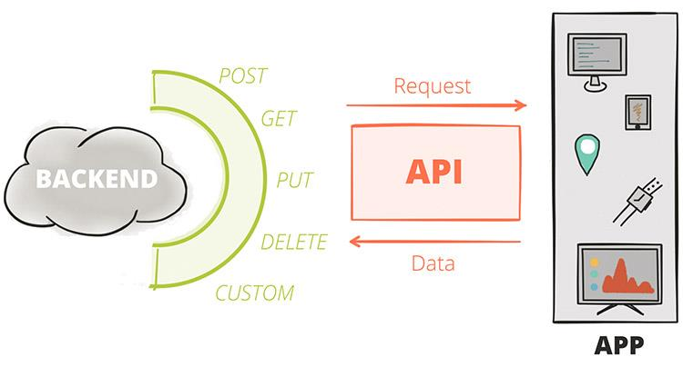

# Understanding APIs and API Testing

## What Is an API?

An Application Programming Interface (API) is a contract that lets one piece of software use another. When a mobile app shows you today's weather, the app itself knows nothing about meteorology — it sends a request to a weather service's API and displays the response. The API sits between the client and the system's data and functionality: the client sends a request, the API receives it, the system retrieves or manipulates the appropriate data, and a response travels back.

The dominant style for web APIs is **REST** (Representational State Transfer). A REST API exposes *resources* — users, orders, products — at URLs called *endpoints*, and clients manipulate those resources using standard HTTP methods. REST's genius is its uniformity: once you can test one REST API, you can test essentially all of them, because they all speak the same protocol. (You will also meet GraphQL, gRPC, SOAP, and WebSocket APIs in the wild; Postman supports them all, and the testing mindset in this book transfers directly.)

## Anatomy of an HTTP Request

Every HTTP request has five key elements, and a tester should be able to name all of them, because each one is something that can be wrong:

- **Method** — the verb describing the intended action. The essential set: **GET** retrieves a resource without changing it; **POST** creates a resource (or triggers an action); **PUT** replaces a resource entirely; **PATCH** modifies part of a resource; **DELETE** removes it. Method semantics matter for testing: GET and PUT are meant to be *idempotent* (repeating them changes nothing further), while POST typically is not — send the same POST twice and you may create two records.
- **URL / URI** — identifies the resource, for example `https://api.example.com/v1/users/42`. Query parameters ride at the end of the URL after a `?`, as in `/users?page=2&limit=50`.
- **Headers** — metadata as key–value pairs: what format the body is in (`Content-Type: application/json`), what format the client will accept (`Accept`), authentication credentials (`Authorization`), and dozens more.
- **Body (payload)** — the data being sent, present on POST, PUT, and PATCH requests. In modern APIs this is almost always **JSON**: human-readable text of nested objects, arrays, strings, numbers, and booleans.
- **HTTP version** — usually invisible in daily work, but part of every exchange.

## Anatomy of an HTTP Response

The response mirrors the request with four elements:

- **Status code** — a three-digit number summarising the outcome. The first digit is the class: **1xx** informational, **2xx** success (200 OK, 201 Created, 204 No Content), **3xx** redirection, **4xx** client error (400 Bad Request, 401 Unauthorized, 403 Forbidden, 404 Not Found, 429 Too Many Requests), **5xx** server error (500 Internal Server Error, 503 Service Unavailable). Status codes are a tester's first assertion in nearly every test — the full reference table is in Appendix A.
- **Headers** — metadata about the response: content type, caching directives, cookies being set, rate-limit counters.
- **Body** — the requested data or the error detail, again usually JSON.
- **HTTP version.**

A useful habit from day one: read responses like a tester, not a user. A `200 OK` wrapping a body that says `"error": "database unavailable"` is a bug twice over — wrong behaviour *and* wrong status code — and only a tester who checks both layers will catch it.

## What Is API Testing?

API testing verifies a system's behaviour at the API layer — beneath the user interface, above the database. You send crafted requests and assert on what comes back: the status code, the response structure, the data values, the headers, and the response time.

Why test here, rather than only through the UI?

- **Speed.** An API test completes in milliseconds; a UI test drives a browser for seconds. A thousand-test API suite can run on every code push.
- **Stability.** APIs change far less often than screens. UI tests break when a button moves; API tests break when behaviour actually changes — which is what you want.
- **Earlier feedback.** The API exists before the UI does. Testing it directly finds defects while they are cheapest to fix.
- **Coverage the UI cannot reach.** Malformed payloads, missing fields, expired tokens, concurrent updates, rate limits — the UI shields users from these paths, but attackers and integrations will find them. API testing is where they get exercised.

In the classic *test pyramid*, API (service-level) tests occupy the broad middle tier: more numerous than end-to-end UI tests, more integrated than unit tests. Teams with a healthy pyramid catch most regressions in seconds, at the API layer.

## The Kinds of API Testing

One tool, many disciplines. Over this book you will practise several distinct kinds of testing, all through Postman:

- **Functional testing** — does each endpoint do what the specification says, for valid and invalid inputs alike? This is the core of Parts II and III.
- **Contract testing** — does the response structure (fields, types, formats) match the agreed schema, so that consumers of the API do not break? Chapter 7 covers schema validation.
- **Integration and workflow testing** — do sequences of calls work end to end: create, then read, then update, then delete? Chapter 7 covers chaining requests.
- **Regression testing** — does everything that worked yesterday still work today? This is what automation (Parts IV and V) exists for.
- **Performance testing** — does the API stay correct and responsive under load? Chapter 10 introduces Postman's performance runs.
- **Security-adjacent testing** — do authentication and authorisation actually gate access? Do error messages avoid leaking internals? Threaded throughout, especially Chapters 4 and 8.

## Meet the Practice API

The hands-on examples in this book use **JSONPlaceholder** ([https://jsonplaceholder.typicode.com](https://jsonplaceholder.typicode.com)) — a free, public fake REST API that needs no signup and never holds real data. Its `/users`, `/posts`, and `/comments` endpoints respond exactly like a real service. (Older tutorials, including this book's first edition, used practice APIs on Heroku's free tier, which no longer exists — if you meet a dead `herokuapp.com` URL in an old collection, that is why.) Everything you learn transfers unchanged to your own team's APIs; only the base URL differs, and Chapter 6 shows you how to make even that a one-click switch.

## Key Takeaways

An API is a contract between software systems; HTTP is the language of that contract; and API testing is the discipline of verifying the contract is honoured — quickly, repeatably, and at every layer of the response. With that foundation, it is time to open the tool.
