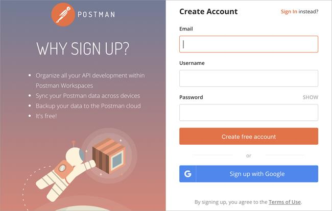
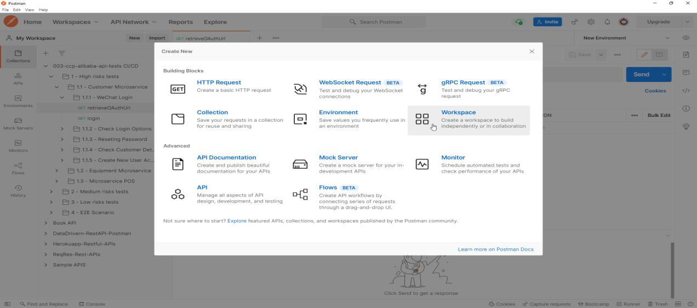
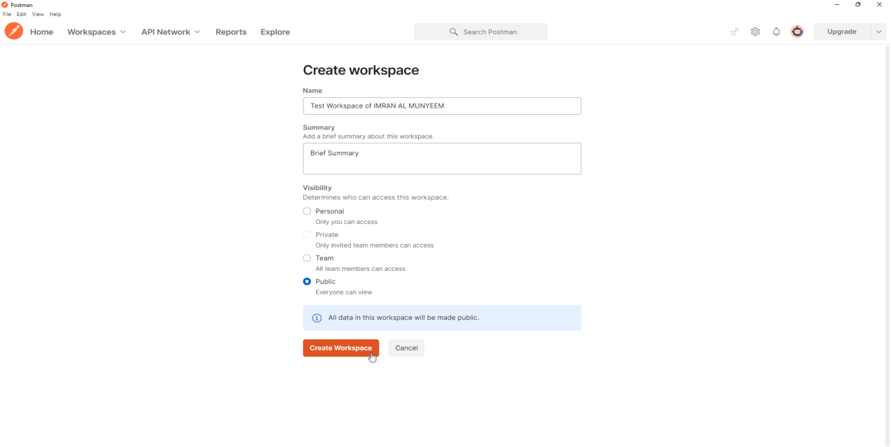

# Getting Started with Postman

Postman began as a simple request-sending extension and has grown into the industry's default API platform: a client for every major protocol, a JavaScript test runtime, documentation and mock-server generators, an AI assistant, and command-line runners that plug into any CI/CD pipeline. It is free to start, runs on Windows, macOS, and Linux, and also offers a full web version at [https://web.postman.co](https://web.postman.co) plus a VS Code extension. This book uses the desktop app, which remains the most complete experience.

## Installing and Signing In

**Step 1** — Download and install Postman from [https://www.postman.com/downloads/](https://www.postman.com/downloads/).

**Step 2** — Sign up with the required information.

**Step 3** — Log in to Postman.

You *can* use Postman's lightweight API client without signing in at all, but an account unlocks everything this book relies on: cloud-synced workspaces, collection sharing, Postbot (Postman's AI assistant), scheduled runs, and CI/CD integrations. For team work, an account is effectively mandatory.

**Security note:** enable two-factor authentication on your Postman account the day you create it. Your workspaces will eventually hold request examples, tokens, and internal URLs; the account protecting them deserves more than a password.

## A Quick Tour of the Interface

Three regions matter from day one. The **sidebar** (left) lists your collections, environments, mock servers, monitors, and history. The **workbench** (centre) is where requests open in tabs — method, URL, parameters, headers, body, scripts. The **response pane** (bottom or right) shows what came back: body, cookies, headers, and test results. Along the footer you will find the **Console** (indispensable for debugging — it logs every request Postman actually sent, resolved variables and all) and **Postbot**, the AI assistant we put to work in Chapter 14.

## Create a Workspace

A workspace is your working area: it groups related collections, environments, mock servers, and monitors in one place. Workspaces can be **personal**, **private**, **team**, or fully **public** — public workspaces are how many companies now publish their official API collections for the world to fork.

**Step 1** — From the workspace menu, click on **New Workspace** and give the workspace a name.

**Step 2** — Choose the visibility that matches your situation — **Personal** while you learn, **Team** or **Private** at work — and click on the **Create Workspace** button.

**Security note:** treat workspace visibility as a security decision, not a cosmetic one. Anything in a public workspace — request URLs, example bodies, any credential carelessly left in a variable — is visible to everyone on the internet, and search engines index public workspaces. Real leaks have happened exactly this way.

**Best practice:** one workspace per product or team, not per person. The workspace is where collaboration happens — reviews, forks, comments — and scattering collections across personal workspaces is how test suites get lost when people change roles.

With the foundation laid and the tool open, you are ready to build the structures every test suite lives in: collections and requests.
