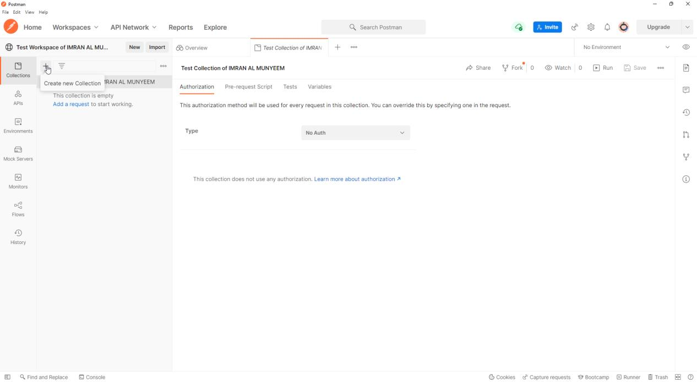
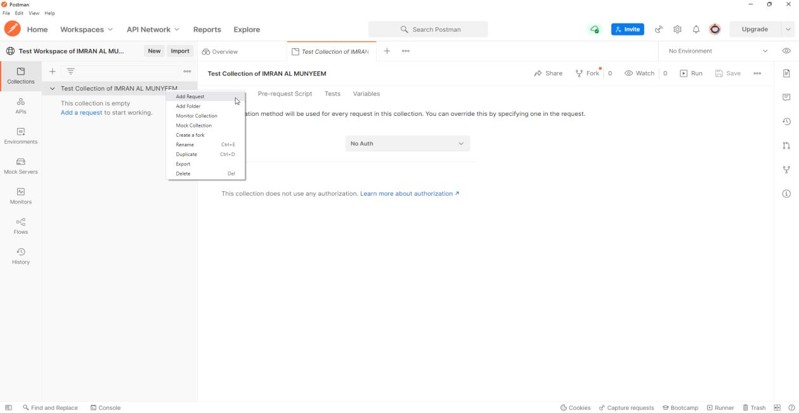

# Collections and Requests

## Create a Collection

A collection groups your API requests together so they can be organised, shared, documented, and — most importantly — run as a single automated unit, both inside Postman and from the command line in your CI pipeline. Think of a collection not as a folder of bookmarks but as the test suite it will grow into.

**Step 1** — Select your workspace from the list.

**Step 2** — Click on the **Create Collection** button.

**Step 3** — Give the collection a name and press Enter.

## Add a Request

**Step 1** — Click on the **Add a request** link, or right-click on the collection, or click on **Add request**.

**Step 2** — Give the request a name.

## Organising a Collection That Scales

The difference between a demo collection and a professional one is structure, and structure is cheapest to add on day one:

- **Folders mirror the API.** One folder per resource or feature — `Users`, `Orders`, `Auth` — with requests inside. Folder-level scripts (Chapter 7) then apply shared setup to exactly the right group.
- **Names describe behaviour, not URLs.** "Login — wrong password returns 401" is a test report line; `POST /api/v1/login` is a puzzle. Six months from now, a collection run report full of behavioural names reads like documentation.
- **Descriptions everywhere.** The collection, each folder, and each request accept Markdown descriptions. Postman generates publishable documentation from them automatically, and Postbot can draft them for you — but even one sentence per request pays for itself the first time a new teammate opens the workspace.
- **Save examples.** After a request returns a good response, save it as an *example* on the request. Examples power Postman's mock servers (Chapter 11) and show consumers what to expect without their having to call anything.

**Pitfall:** resist the "one giant collection" temptation. When a collection mixes exploratory scratch requests with the regression suite, CI runs become slow and flaky. Keep a personal scratch collection for exploration and a disciplined, folder-structured collection for the automated suite.
