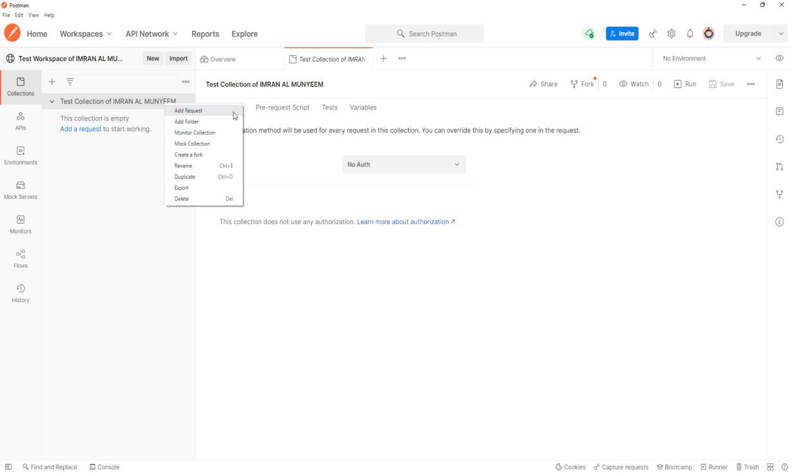
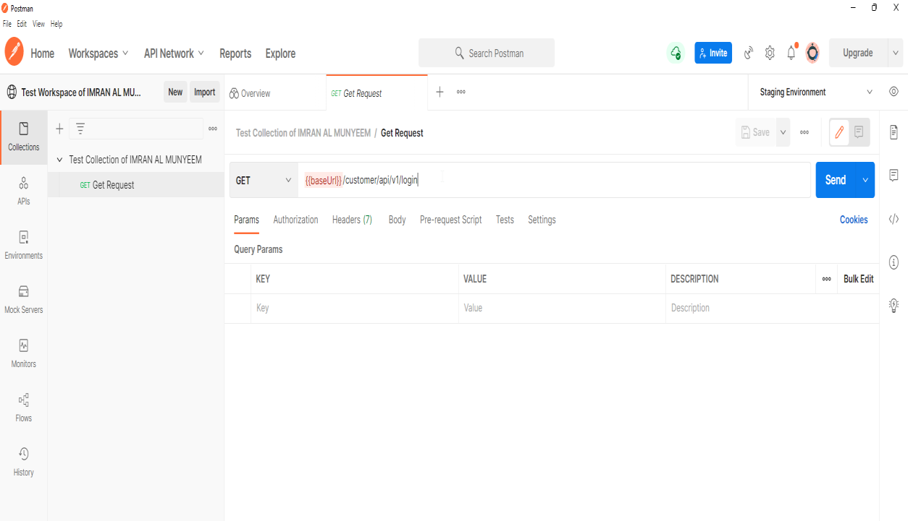
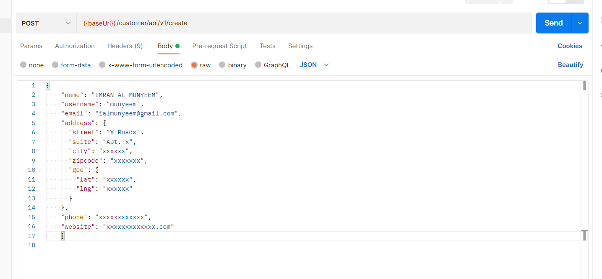
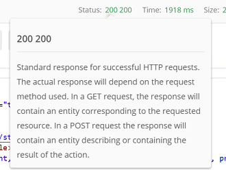
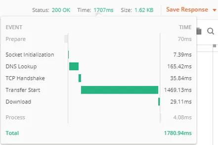
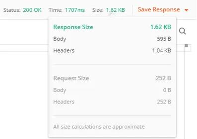
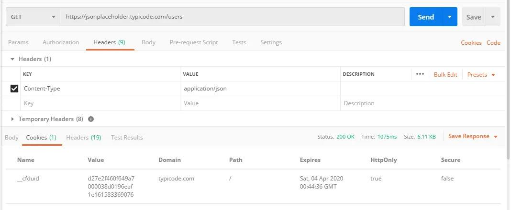
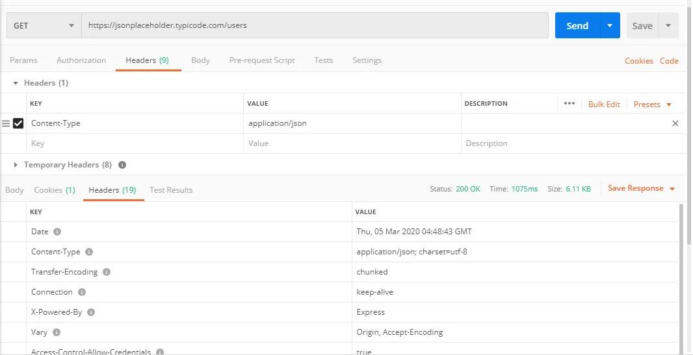
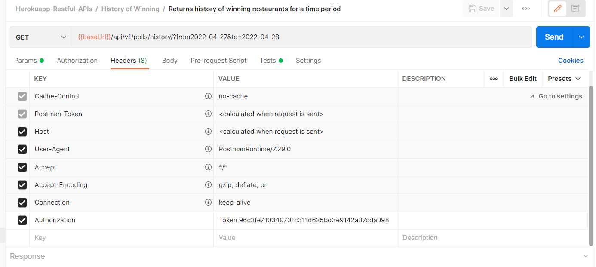

# Sending Requests and Reading Responses

This chapter is where testing becomes tactile: crafting requests with each important HTTP method, then dissecting everything the server sends back.

## Send a GET Request

**Step 1** — Click a **new** tab to add a new request.

**Step 2** — Create a GET request for a REST API endpoint:

- Set your HTTP request method to **GET**.
- Input the link in the request **URL** field — for example `https://jsonplaceholder.typicode.com/users`.
- Click on **Send** to execute.

The response arrives in the lower pane: a JSON array of users, plus a status of **200 OK**. Congratulations — you have just performed your first API test, informally. The rest of the book makes it formal, repeatable, and automatic.

## Send a POST Request

POST requests are used for data manipulation — adding data to the endpoint. Let's add a user to the application. To do this we send data in the *body* of the request, and the API returns data in response, confirming the user has been created.

**Steps:**

- Set your HTTP request method to **POST**.
- Input the link in the request **URL** field.
- Click on the **Body** tab, select the **raw** radio button, then select **JSON**. Paste a single user object — copying one result from the previous GET request is a quick way to get the structure right.

Send it, and note two things a tester always notes: the status code is **201 Created** (not a generic 200 — creation has its own code), and the response body echoes the created resource, typically with a server-assigned `id`. That returned `id` is the thread we will pull in Chapter 7 to chain requests together.

## The Rest of the Method Family

The same pattern covers the remaining methods, and a complete functional suite exercises all of them:

- **PUT** replaces a resource entirely — send the *full* object to `/users/1` and expect 200 with the replaced resource.
- **PATCH** modifies part of a resource — send only the changed fields.
- **DELETE** removes it — expect 200 or 204, and then a follow-up GET should return 404. (That follow-up is the real test; deletion that only *claims* to work is a classic bug.)

**Pitfall:** JSONPlaceholder, like many practice APIs, *simulates* writes — your POST returns 201 but nothing is truly stored. Perfect for learning the mechanics; just don't be surprised when a GET doesn't show your new user.

## Analyse Responses

After the server responds, the response pane holds far more than the body, and each element is something a test can assert on.

**Status code.** You will see **200 OK** when a GET succeeds. Hover over the status for an explanation of what the code means.

**Response time.** Hover over the time to see individual components — DNS lookup, TCP handshake, transfer start, download. When an endpoint is slow, this breakdown tells you *where* the time went, which is the difference between "it's slow" and a useful bug report.

**Response size.** Similarly decomposed into body and headers. A payload that balloons from 5 KB to 5 MB after a release is a regression even if every field is technically correct.

**Cookies.** Session-related information returned by the server appears in the Cookies tab.

**Response headers.** Metadata about the processed request.

The headers a tester reads first:

- **Content-Type** — the format of the response, such as `application/json`. If your API claims JSON but returns HTML (typically an error page), tests that parse the body will fail confusingly; assert the content type early.
- **Date** — the server's timestamp for the response.
- **Server** — which server software responded. (Security teams often prefer this header suppressed; noticing it is a small security finding.)
- **Cache-Control / Expires** — whether intermediaries may cache the response; wrong caching on personalised data is a serious bug.
- **Set-Cookie** and its expiry — what session state the server is establishing.

## Authenticating Your Requests

Real APIs are protected, so your requests must prove who they are. Postman gives you two routes.

**The modern way — the Authorization tab.** Every request (and the collection itself) has an **Authorization** tab supporting the schemes you will meet in practice: **Bearer Token**, **API Key**, **Basic Auth**, **OAuth 2.0** (with Postman driving the full token flow, including refresh), **JWT**, **AWS Signature**, and more. Pick the type, supply the credentials, and Postman constructs the correct header on every send.

**Best practice:** configure authorisation once at the **collection** level and let every request inherit it; store the token itself in an environment variable of type *secret* (Chapter 6), so switching environments switches credentials too.

**The manual way — headers.** You can also supply credentials directly, which is exactly what the Authorization tab generates under the hood:

- Click on **Headers**.
- Enter `Authorization` as the key.
- Put the credential in the **Value** field — for example `Bearer eyJhbGci...` or `Token 96c3fe...`.

Knowing the manual form matters: it is what you will reproduce when debugging with cURL, reading raw HTTP traffic, or writing client code.

**Testing angle:** authentication is not just plumbing to get through — it is a test surface. A professional suite always includes the negative cases: no token (expect 401), an expired token (401), a valid token for the *wrong* user or role (403). Chapter 8 builds these into your strategy.

## Key Takeaways

You can now speak full HTTP through Postman: every method, every part of the response, authenticated or not. So far, though, *you* are the assertion engine — you look at the response and judge it. The next part of the book teaches Postman to judge for you.
