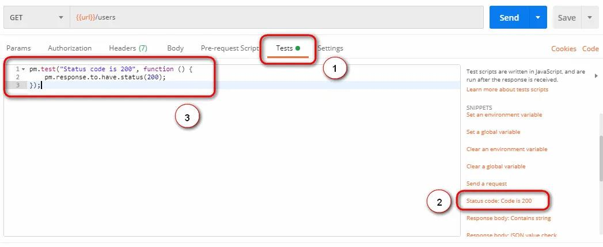
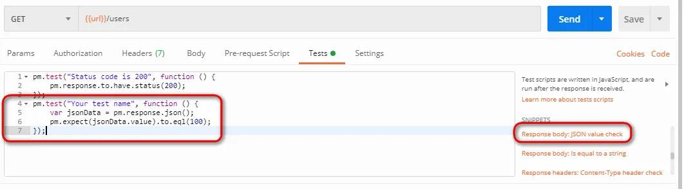
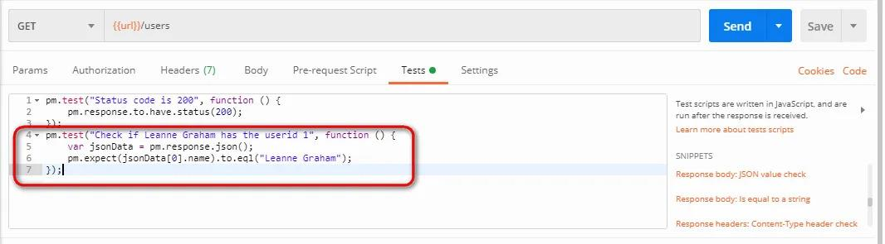
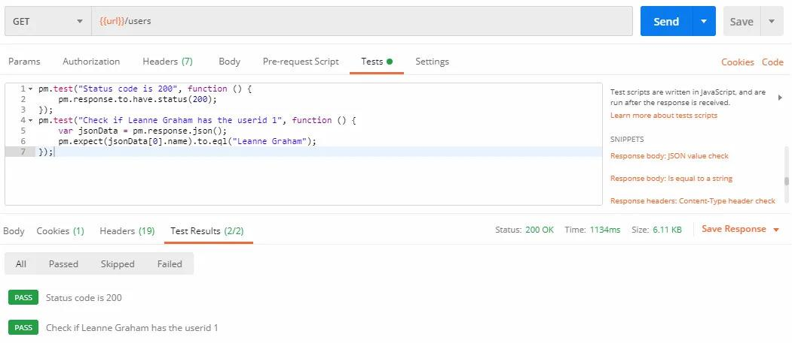

# Your First Tests

Postman tests ensure that your API works as expected, that integrations between services function reliably, and that new development hasn't broken existing functionality. A test is a small piece of JavaScript that runs automatically after a response arrives and reports pass or fail.

## Where Tests Live Today

In current versions of Postman, the old **Tests** tab has been reorganised into a single **Scripts** tab with two sections: **Pre-request** (code that runs before the request is sent) and **Post-response** (code that runs after the response arrives). Your tests go in **Scripts → Post-response**. The screenshots in this chapter show the earlier Tests tab; the snippets, code, and workflow are identical — only the tab name has changed.

Under the hood, Postman's scripting sandbox is JavaScript on a Node.js-based runtime, with the **Chai.js** assertion library built in — which is why tests read almost like English: `pm.expect(value).to.eql(expected)`. The `pm` object is your API into everything: `pm.response`, `pm.environment`, `pm.test`, and more.

## Your First Assertion: Status Code

**Step 1:**

- Go to the **GET request** we created earlier.
- Switch to the **Scripts → Post-response** tab (the **Tests** tab in older versions).
- From the **Snippets** section, click on **"Status code: Code is 200"**. The script is auto-populated.
- Click on **Send**.



The generated code:

```javascript
pm.test("Status code is 200", function () {
    pm.response.to.have.status(200);
});
```

Read it as a sentence: *define a test named "Status code is 200" whose body asserts the response has status 200.* Every test you ever write in Postman follows this shape — a name, and a function containing one or more assertions.

## Comparing Expected to Actual

Now a test with real content: verifying a value in the body.

**Step 2:**

- Click on **"Response body: JSON value check"** from the Snippets section.
- We will check whether *Leanne Graham* is the user with ID 1.



**Step 3:**

- Rename the test to describe exactly what it verifies: replace `"Your Test Name"` with `"Check if Leanne Graham has the userid 1"`.
- Replace `jsonData.value` with `jsonData[0].name` — the path is visible in the body of the GET response.
- Since "Leanne Graham" is the first record, the index is 0; the second record is `jsonData[1]`, and so on.

```javascript
pm.test("Check if Leanne Graham has the userid 1", function () {
    var jsonData = pm.response.json();
    pm.expect(jsonData[0].name).to.eql("Leanne Graham");
});
```



**Step 4:** Click **Send**. The **Test Results** tab of the response pane shows each test with a green PASS or red FAIL.



**N.B.:** Tests fail for three broad reasons — the API's behaviour genuinely changed (a real finding), the test script is wrong (fix the test), or the network hiccuped (rerun, and consider whether your suite needs retry tolerance). Learning to triage a red test quickly is a core professional skill.

## The Assertions You Will Use Daily

The snippets are a starting vocabulary; here is the working set, all writable by hand:

```javascript
// Status and performance
pm.test("Status is 200", () => pm.response.to.have.status(200));
pm.test("Responds within 500 ms", () => {
    pm.expect(pm.response.responseTime).to.be.below(500);
});

// Headers
pm.test("Content-Type is JSON", () => {
    pm.expect(pm.response.headers.get("Content-Type"))
        .to.include("application/json");
});

// Body values and structure
const body = pm.response.json();
pm.test("Returns 10 users", () => pm.expect(body).to.have.lengthOf(10));
pm.test("First user has an email", () => {
    pm.expect(body[0]).to.have.property("email");
    pm.expect(body[0].email).to.be.a("string").and.to.include("@");
});
```

**Best practice:** one behaviour per test. A single giant test with twenty assertions stops at the first failure and hides the other nineteen results; twenty small tests give you the full diagnostic picture in one run.

**The AI shortcut:** you no longer have to write every test by hand — Postbot (Chapter 14) can generate this entire suite from a prompt like *"add tests for the status code, response time, and the schema of the response"*, and can repair a failing script. Learn the manual craft first, exactly as in this chapter: it is what lets you review, trust, and correct what the AI produces.
