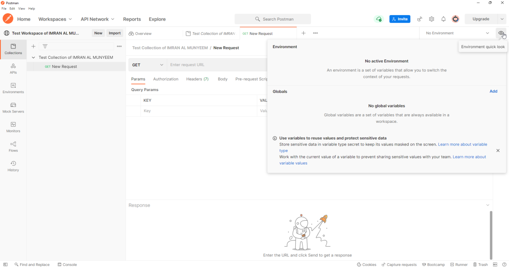
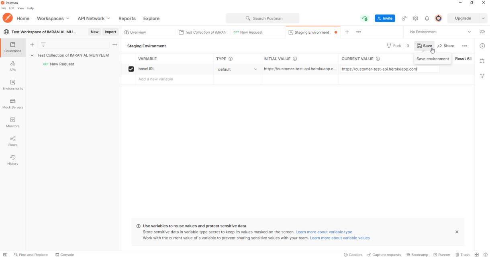
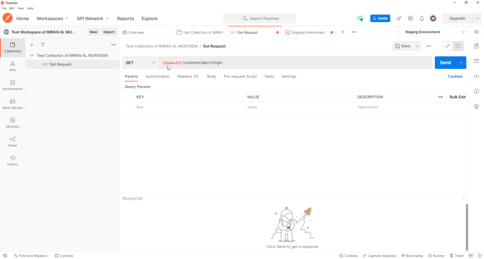
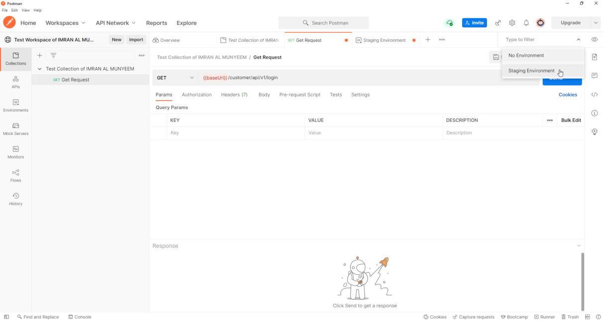

# Variables and Environments

Hard-coded values are the enemy of scale. The moment your suite must run against staging *and* production, or a hundred requests share one base URL, you need variables — and Postman's variable system, used well, is what makes a collection portable across machines, environments, and CI pipelines.

## Create an Environment

An environment is a named set of key–value pairs. The same collection, pointed at different environments, becomes a smoke suite for every stage of your pipeline.

**Step 1** — Click on the eye icon.

**Step 2** — Click on the **Add** button and give the environment a name — `Staging`, say.

**Step 3** — Set the **VARIABLE** as `baseUrl` and the **INITIAL VALUE** to your API's base URL — for example `https://jsonplaceholder.typicode.com`, or your team's staging URL.

**N.B.:** The **CURRENT VALUE** is set automatically after you set the initial value.

**Step 4** — Now go back to the collection and replace the hard-coded base URL with `{{baseUrl}}`.

**Step 5** — Click the **Save** button after adding the URL and variables.

**Important note:** *when you use a variable, reference it inside double curly brackets.* You will see `{{baseUrl}}` turn orange when it resolves. If it stays red, either the name is misspelt or no environment is selected.

**Step 6** — Select the environment from the environment list.

Create a second environment — `Production` — with the same variable *names* and different values, and switching your entire suite between environments becomes a one-click act. That symmetry of names is the discipline: environments should differ in values, never in structure.

## The Five Variable Scopes

Postman resolves variables through five scopes, narrowest wins:

**local > data > environment > collection > global**

- **Global** variables live outside any environment — quick, convenient, and best kept for prototyping.
- **Collection** variables travel *with* the collection, making them ideal for constants that belong to the suite itself (API version strings, fixed test record IDs) — they work even when someone imports your collection without your environments.
- **Environment** variables are the workhorses: everything that differs between staging and production.
- **Data** variables come from a CSV/JSON file during data-driven runs (Chapter 10).
- **Local** variables exist only for a single request or iteration — set them in scripts to override everything temporarily; they vanish when the run ends.

In scripts, each scope has an API: `pm.environment.get("baseUrl")`, `pm.collectionVariables.set("userId", id)`, `pm.globals.get(...)`, and the scope-walking `pm.variables.get(...)` which respects the precedence order.

## Secrets: the Part Everyone Gets Wrong Once

Two facts about Postman variables have security consequences:

1. **Initial values sync to Postman's servers** and are shared with anyone who can see the workspace. **Current values stay local to your machine.**
2. Exported environment files contain values in plain text.

Therefore: real credentials go in **current values only**; set their variable type to **secret** so they are masked on screen; and for the most sensitive material, use **Postman Vault**, which keeps values encrypted locally and entirely out of cloud sync. In CI, don't ship credentials in files at all — inject them from the pipeline's secret store (Chapter 13 shows how).

**Pitfall:** the classic leak is a Bearer token pasted into an *initial* value "just for a second," then synced, then forked into a public workspace. Decide your secret-handling rules on day one, before there is anything to leak.
