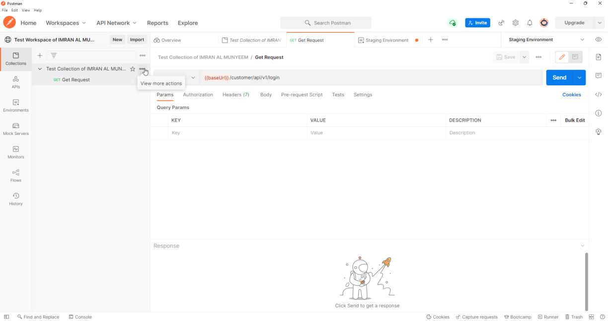
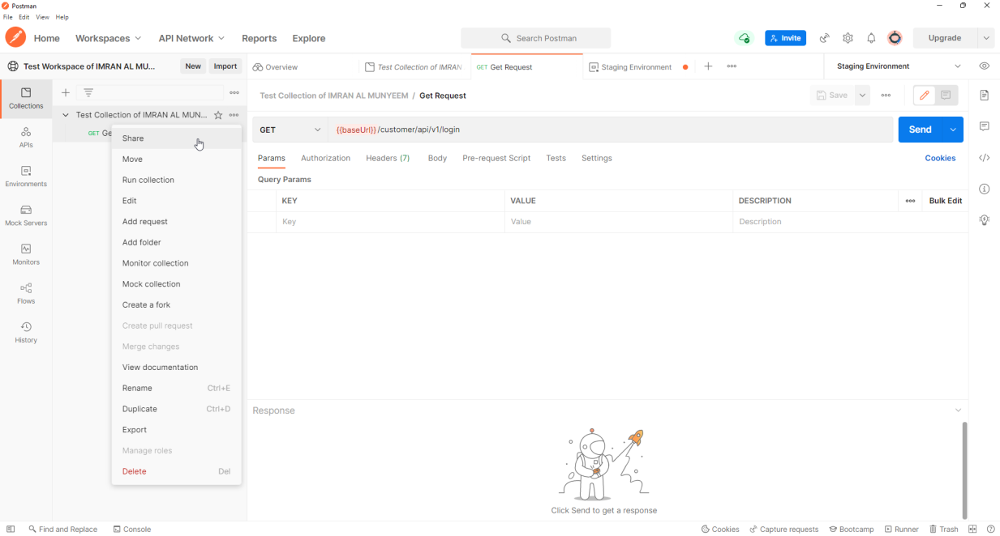
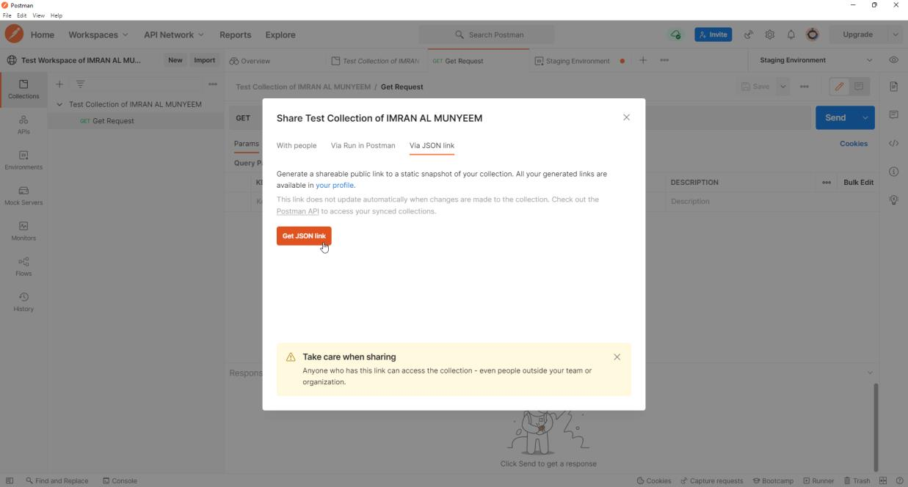
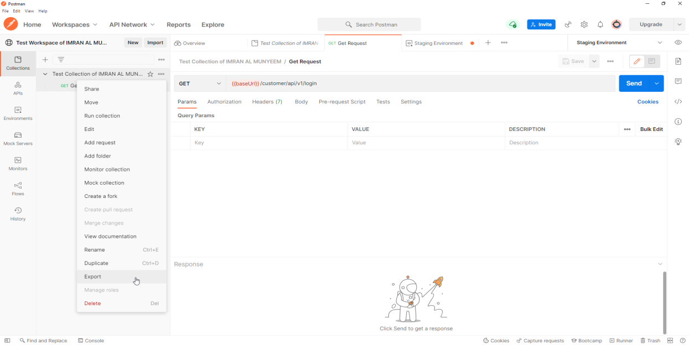
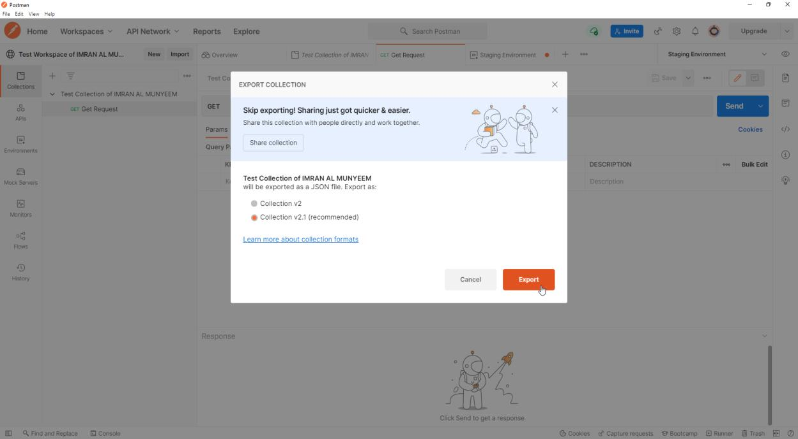
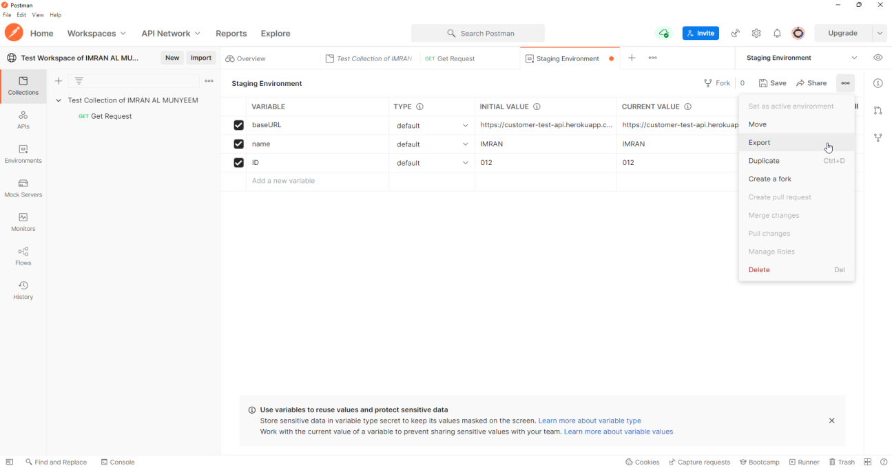
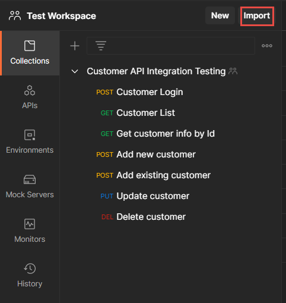
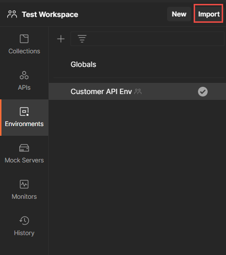

# Sharing Your Work: Export and Import

The exported JSON file you will meet in this chapter is more than a sharing convenience — it is exactly what the command-line runners in Chapter 12 consume, which makes exporting the bridge between Postman-the-app and Postman-in-your-pipeline.

## Share a Collection from Postman

**Step 1** — Click on the **[…]** button beside your collection.

**Step 2** — Click on **Share collection**.

**Step 3** — Choose how to share it — with specific people, via **Run in Postman**, or via a JSON link.

**Step 4** — Anyone with access can import or fork the collection.

**Best practice:** with teammates, skip links entirely — move the collection into a shared **team workspace**. Everyone then works on the live collection with version history, forking, and pull-request-style merges, instead of emailing snapshots that immediately go stale. A JSON link is a static snapshot, and anyone holding it can read the collection — never link a collection containing credentials.

## Export a Collection as a File

**Step 1** — Click on the **[…]** button beside your collection, as before.

**Step 2** — Click on the **Export** button, choose **Collection v2.1 (recommended)**, and save the file to your local disk.

**A modern note:** Postman v12 introduced a newer **collection v3 (YAML)** format used by its Native Git workflows. Newman, the classic command-line runner, does not support v3 — only the Postman CLI does. For maximum compatibility with existing tooling, v2.1 JSON remains the safe default export today.

**Best practice — version the suite:** commit the exported collection (and sanitised environments) to the same Git repository as the code it tests, under a `collections/` folder. Tests then ride through code review, branch with features, and are available to every CI agent — the pattern Chapter 13 builds on.

## Export an Environment

In the same way, export the environment and save it alongside the collection.

**Security note:** an exported environment file contains its variable values in plain text. Before committing one to Git, strip tokens and passwords — or keep secrets in **current values** only (which are never exported) and inject real credentials in CI from the pipeline's secret store.

## Import a Collection

**Step 1** — Go to the **Collections** tab.

**Step 2** — Click on the **Import** button.

You can import from files, folders, links, or raw text — and not only Postman's own format: Postman imports **OpenAPI/Swagger definitions** (generating a full collection from the spec, a superb starting point for contract tests) and **cURL commands** copied from browser dev tools or documentation.

## Import an Environment

**Step 1** — Go to the **Environments** tab.

**Step 2** — Click on the **Import** button.

**Step 3** — Locate the environment file you exported earlier. The importer can now run every request in the collection.
