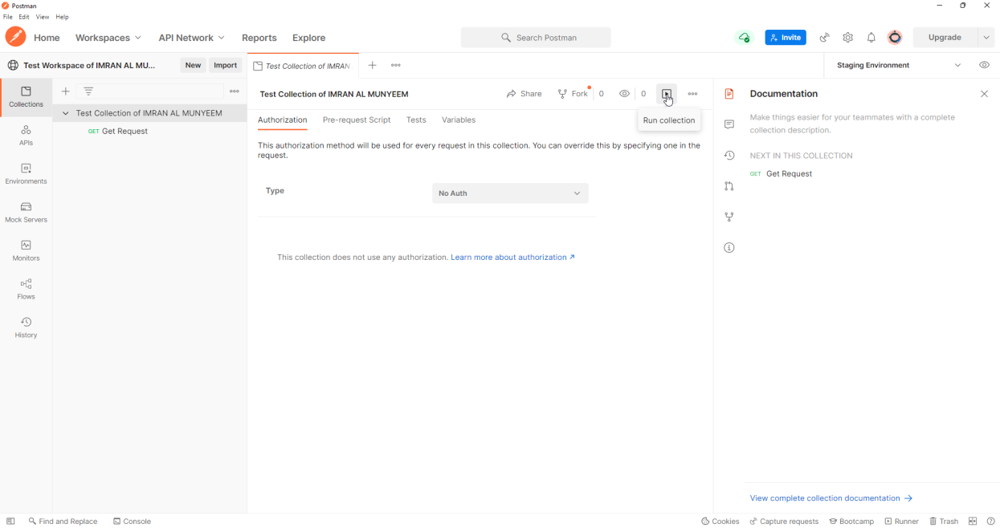
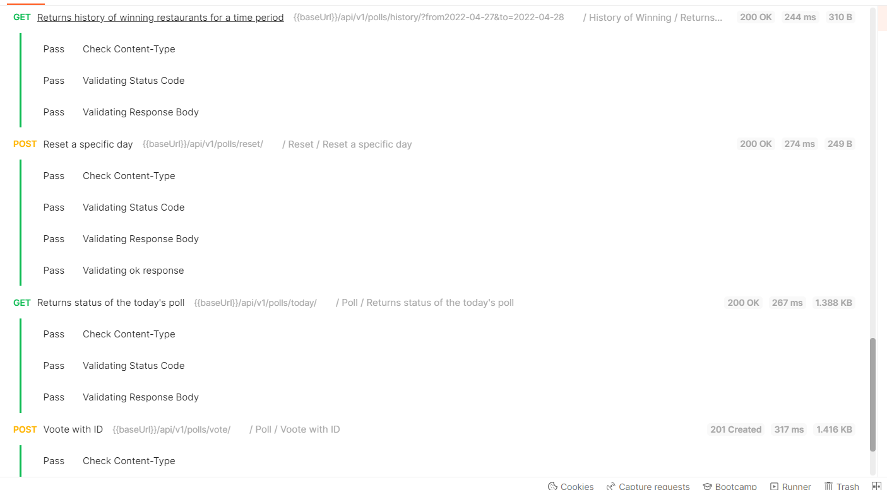
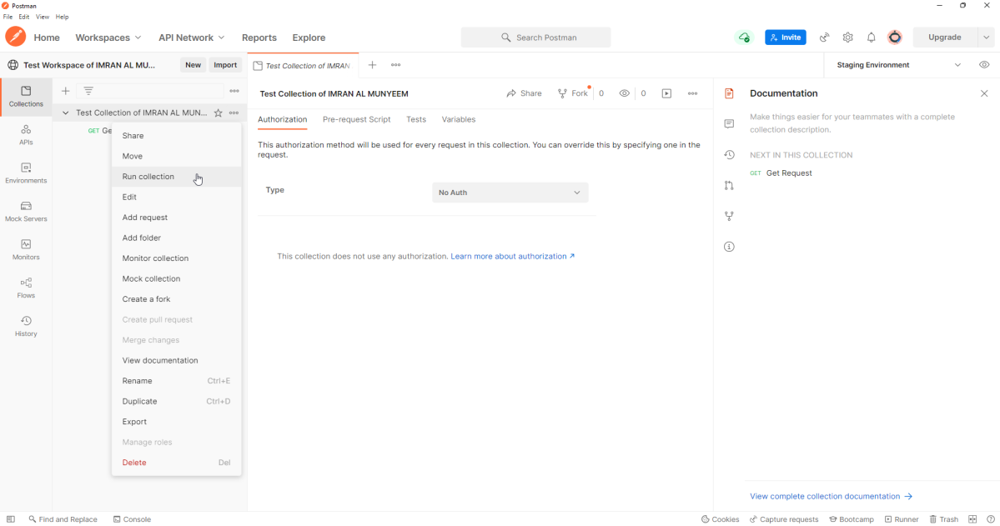
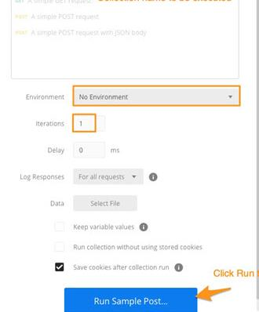

# Running Collections at Scale

Sending requests one by one is exploration. The **Collection Runner** executes the whole suite — every request, every test, in order — and is the same engine your CI pipeline will drive in Part V.

## Run from the Run Tab

**Step 1** — Select your collection and click the **Run** button.



**Step 2** — **Iterations** defaults to 1, meaning the whole suite runs once. Click run, and watch the results stream in: each request with its status, time, size, and every test's pass/fail.



## Run from the Actions Menu

**Step 1** — Click on **Run** from the **[…]** menu.



**Step 2** — Configure the run — environment, iterations, delay, data file — then start it.



The options that matter:

- **Environment** — which set of variables to run against; this is where the staging/production switch pays off.
- **Iterations** — run the suite N times; combined with random data (Chapter 7), a quick stability check.
- **Delay** — milliseconds between requests, a courtesy to rate-limited APIs.
- **Data file** — the gateway to data-driven testing, next.

## Data-Driven Testing

Supply a CSV or JSON file and the runner executes one iteration per row, resolving `{{columnName}}` variables from the file. A login endpoint tested against a spreadsheet of credential cases is the classic example:

```
email,password,expectedStatus
valid@example.com,correct-pass,200
valid@example.com,wrong-pass,401
,correct-pass,400
not-an-email,correct-pass,400
```

The request body uses `{{email}}` and `{{password}}`, and the test reads the expectation from the same row:

```javascript
pm.test("Status matches the data file", () => {
    pm.response.to.have.status(
        Number(pm.iterationData.get("expectedStatus"))
    );
});
```

One request, one test, dozens of cases — and adding a case is now a spreadsheet edit, which means non-programmers on the team can extend coverage. This is Chapter 8's negative-and-boundary strategy industrialised.

## Scheduled Runs and Performance Tests

From the runner screen you can also **schedule** the collection to run on Postman's cloud at a chosen frequency — a zero-infrastructure nightly regression, with results waiting in the workspace each morning. And on paid plans, the same screen offers **performance testing**: simulated virtual users driving your collection in parallel, with latency and error-rate graphs. Performance runs answer the question functional tests cannot: does the API stay correct *under load*? Watch for the tell-tale professional finding — response times that hold steady while error rates climb, or vice versa.
