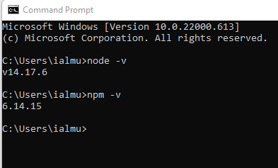
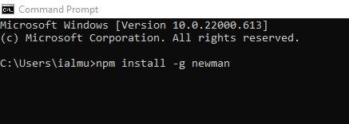
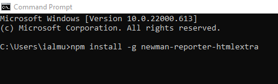
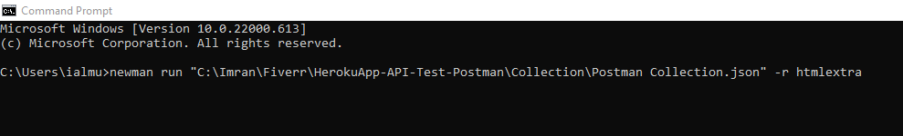

# The Command Line: Newman and the Postman CLI

Running collections from a terminal is what turns your Postman tests into automation. Today there are **two** command-line runners, and a professional knows both:

- **Newman** — the classic, open-source runner, installed via npm. It has years of tutorials behind it and a rich ecosystem of community reporters — most notably **htmlextra**, whose HTML reports remain the best stakeholder-friendly output in the ecosystem. Note that Newman supports the collection v2/v2.1 JSON format only; it cannot run the newer v3 YAML collections introduced with Postman v12.
- **Postman CLI** — the official, Postman-built successor, introduced with Postman v10 and actively developed since. It authenticates with a Postman API key, can run collections straight from your workspace **without exporting anything**, sends results back to Postman's cloud as a shareable run report, and adds API linting/governance on enterprise plans.

For a brand-new pipeline the Postman CLI is the natural starting point; Newman remains fully supported and is everywhere in existing CI systems. Both exit with code `0` on success and non-zero when any test fails — the exact signal CI systems use to pass or fail a build.

## Option A — Newman with an HTML Report

**Step 1** — Check whether Node.js and npm are installed. Open a terminal and run `node -v` and `npm -v`.



**Step 2** — If not, install the current **LTS** version of Node.js from [https://nodejs.org/](https://nodejs.org/) — npm ships with it.

**Step 3** — Install Newman globally:

```
npm install -g newman
```



**Step 4** — Install the htmlextra reporter:

```
npm install -g newman-reporter-htmlextra
```



**Step 5** — Run the collection with an environment, producing both console output and an HTML report:

```
newman run "MyCollection.postman_collection.json" -e "Staging.postman_environment.json" -r cli,htmlextra
```



**Step 6** — A folder named **newman** is created automatically, containing the report — open it in a browser for a full dashboard of requests, tests, and failures.

**Step 7** — The switches you will actually use: `-d data.csv` for data-driven runs, `-n 10` for iteration counts, `--folder "Smoke"` to run a single folder, `--env-var "token=$TOKEN"` to inject a secret from the shell without any file. Full reference: [https://www.npmjs.com/package/newman](https://www.npmjs.com/package/newman).

## Option B — the Postman CLI

**Step 1** — Install the Postman CLI with the one-line installer for your OS from [https://learning.postman.com/docs/postman-cli/postman-cli-installation/](https://learning.postman.com/docs/postman-cli/postman-cli-installation/).

**Step 2** — Generate a Postman API key from your profile settings and log in:

```
postman login --with-api-key YOUR_API_KEY
```

**Step 3** — Run a collection — from a local export, exactly like Newman:

```
postman collection run "MyCollection.postman_collection.json" -e "Staging.postman_environment.json"
```

…or **directly from your workspace by ID**, no export step at all:

```
postman collection run 12345678-abcd-efgh-ijkl-9876543210ab
```

**Step 4** — At the end of the run, the CLI prints a link to a full run report in your workspace — pass/fail per test, response times, console output — shareable with anyone on the team.

**Choosing between them:** exported-file workflows and rich local HTML reports favour Newman; workspace-live collections, cloud reporting, and governance favour the Postman CLI. Many teams run both during a transition, since the command shapes are nearly identical.
