# Continuous Integration: Jenkins and GitHub Actions

Continuous integration is where API tests earn their keep: every push, every merge, every night — the whole collection runs, and the build goes red the moment an API breaks. This chapter sets up Jenkins, the long-standing workhorse of CI, then shows the modern cloud-native equivalent in GitHub Actions. The principle is identical everywhere: *install a runner, execute the collection, respect the exit code.*

## Set Up Jenkins

**Step 1** — Install a supported Java runtime and set its environment variable. **Modern Jenkins requires Java 21** (recent LTS lines dropped Java 17 and older — the Java 8 instructions in old tutorials will not work). The easiest source is Eclipse Temurin: [https://adoptium.net/](https://adoptium.net/). Verify with:

```
java -version
```

**Step 2** — Download the Jenkins WAR file (or a native installer) from [https://www.jenkins.io/download/](https://www.jenkins.io/download/).

**Step 3** — Go to the Jenkins file's location, open a terminal, and run:

```
java -jar jenkins.war
```

This starts the Jenkins server on local port 8080. (**N.B.:** don't close the terminal. On a real build server, install Jenkins as a service instead.)

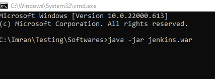

**Step 4** — Open Jenkins in your browser at [http://localhost:8080/](http://localhost:8080/).

**Step 5** — Complete the setup wizard and log in.

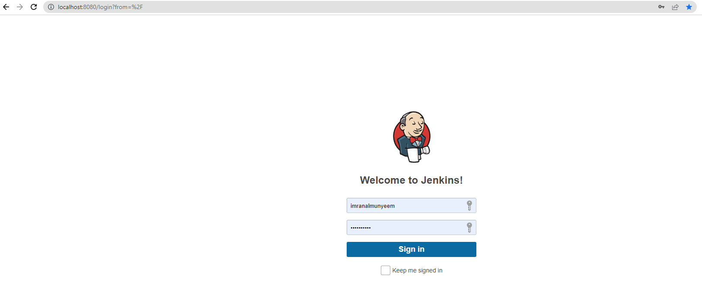

**Step 6** — Click on **Manage Jenkins**, open **Plugins**, and install the recommended plugins. While you are there, also install the **NodeJS** plugin — it lets Jenkins provision Node.js and install Newman on the build agent automatically, far more reliable than depending on whatever happens to be installed on the machine.

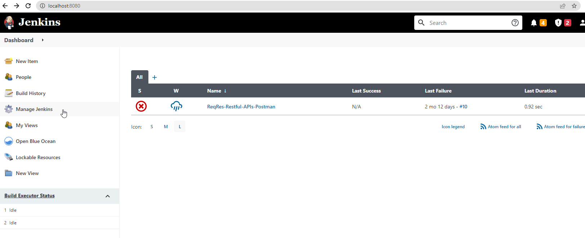

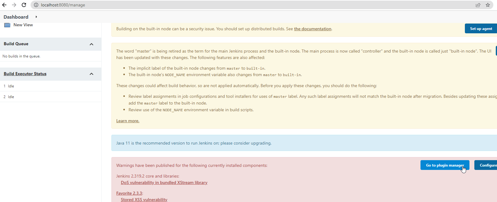

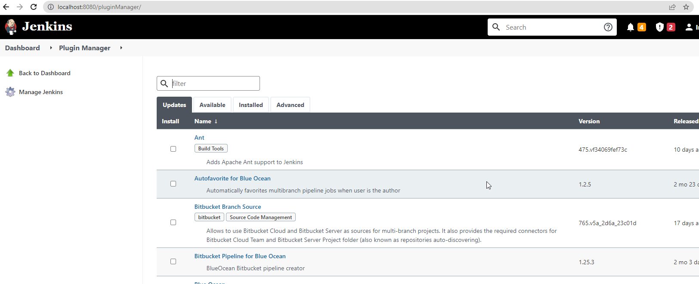

**Step 7** — Click on **New Item**, enter a project name, select **Freestyle project** (the simplest to learn with), and save.

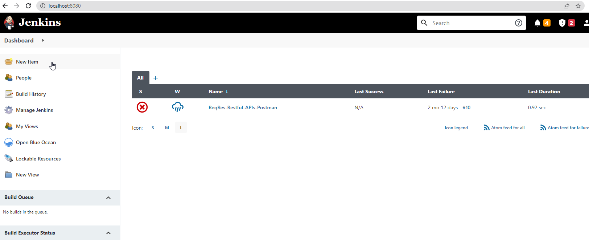

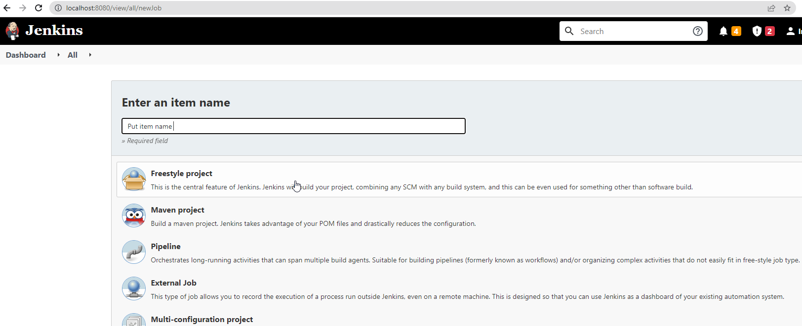

**Step 8** — Open the project and click **Configure**.

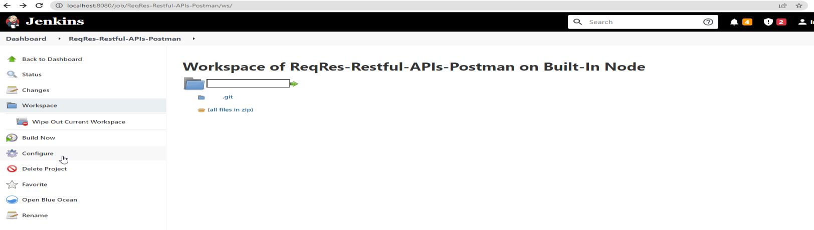

## Run from a Local Path

**→** Set **Source Code Management** to **None**.

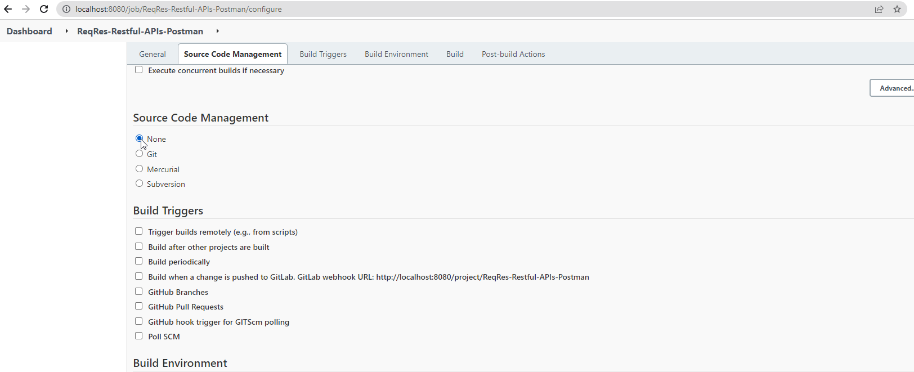

**→** Add a build step — **Execute Windows batch command** on a Windows agent, or **Execute shell** on Linux/macOS — with the Newman command and the collection's path, then save:

```
newman run "C:\Projects\API-Tests\MyCollection.postman_collection.json" -r cli,htmlextra
```


**→** Click **Build Now**.

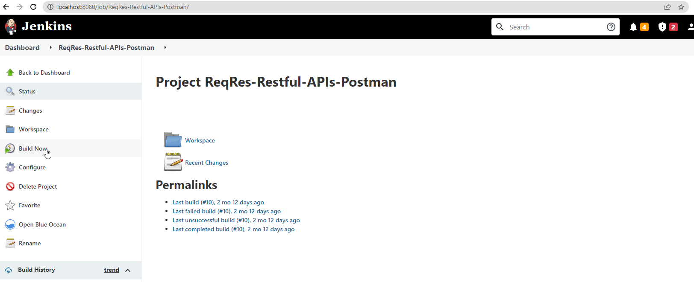

**→** Click **Console Output** to watch the run; **View as plain text** gives the raw view.


## Run from GitHub

Keeping the collection export in a Git repository — alongside the code it tests — is the scalable pattern: the tests are versioned, code-reviewed, and available to every build agent.

**→** Tick **GitHub project** under **General** and enter the repository URL.

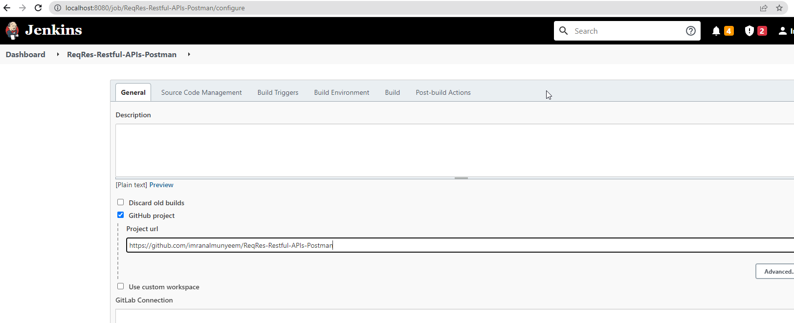

**→** Set **Source Code Management** to **Git** and add the repository link. **N.B.:** add credentials if the repository is private.

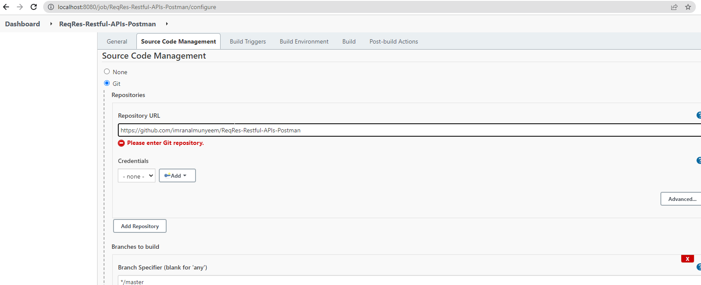

**→** Add the same build step as before — the collection is now checked out into the job's workspace, so the path is relative:

```
newman run "collections/MyCollection.postman_collection.json" -r cli,htmlextra
```

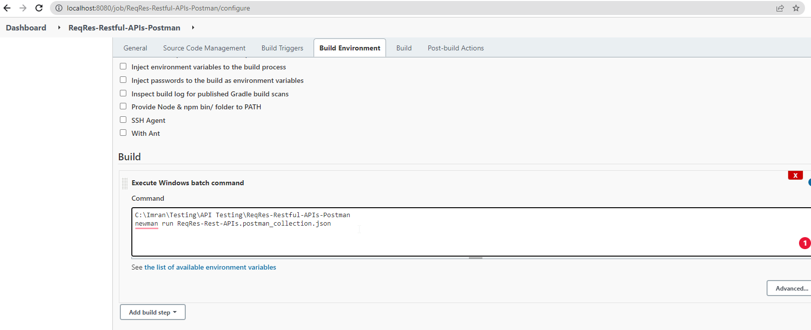

**→** Click **Build Now**.


**→** Review the **Console Output** as before.

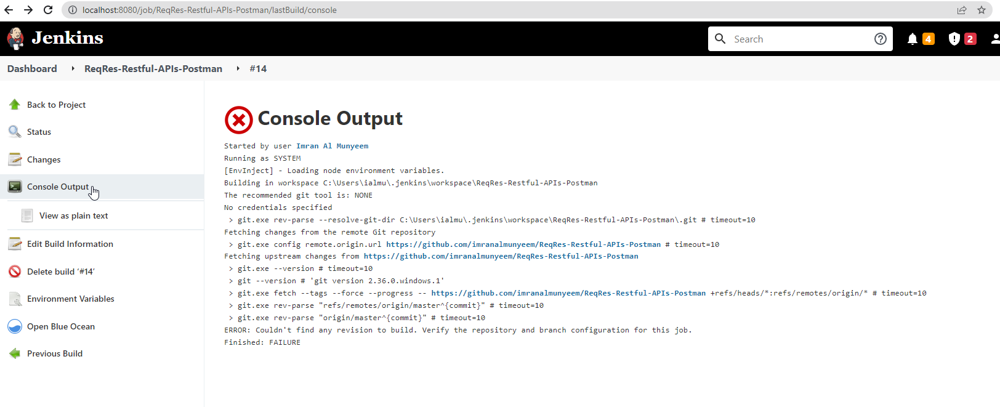

## Automate and Schedule

Put the Newman (or `postman collection run`) command in the build step, and every build runs the suite; because the runner exits non-zero on any failing test, a failing API test automatically fails the Jenkins build — exactly the safety net you want. To run on a schedule as well, open **Build Triggers**, tick **Build periodically**, and supply a cron expression — `H 2 * * *` runs the suite nightly around 2 a.m.

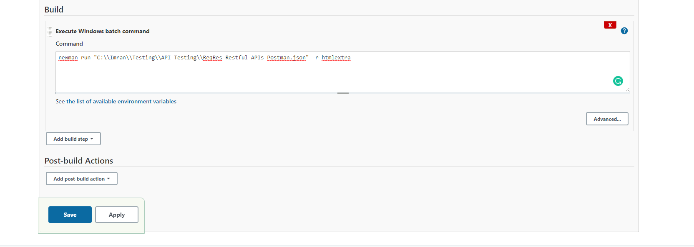

**Handling secrets in Jenkins:** never hard-code tokens in the build step. Store them in Jenkins **Credentials**, bind them to environment variables in the job, and pass them through: `newman run ... --env-var "token=%API_TOKEN%"` (Windows) or `"token=$API_TOKEN"` (shell). The token then never appears in the job configuration or the console log.

## The Cloud-Native Alternative — GitHub Actions

If your code lives on GitHub, the same tests can run with no server to maintain at all. Create `.github/workflows/api-tests.yml` in the repository:

```yaml
name: API Tests
on:
  push:
  schedule:
    - cron: "0 2 * * *"   # nightly at 02:00 UTC

jobs:
  postman-tests:
    runs-on: ubuntu-latest
    steps:
      - uses: actions/checkout@v4
      - uses: actions/setup-node@v4
        with:
          node-version: "lts/*"
      - name: Install Newman
        run: npm install -g newman newman-reporter-htmlextra
      - name: Run collection
        env:
          API_TOKEN: ${{ secrets.API_TOKEN }}
        run: >
          newman run collections/MyCollection.postman_collection.json
          -e environments/Staging.postman_environment.json
          --env-var "token=$API_TOKEN"
          -r cli,htmlextra
      - name: Upload report
        if: always()
        uses: actions/upload-artifact@v4
        with:
          name: newman-report
          path: newman/
```

Every push — and every night — GitHub spins up a clean runner, installs Newman, runs the collection, fails the build on any failing test, and attaches the HTML report to the run. The credential comes from the repository's encrypted **Secrets**, never from a file. The Postman CLI pattern is identical: store the Postman API key as a secret, `postman login --with-api-key` in one step, run the collection by ID in the next. GitLab CI, CircleCI, and Azure Pipelines follow the same recipe.

**The finish line:** with this chapter in place, your suite has completed the journey — from a request you clicked by hand in Chapter 4 to a gate that every code change must pass. One frontier remains: the AI now reshaping how the tests themselves get written.
