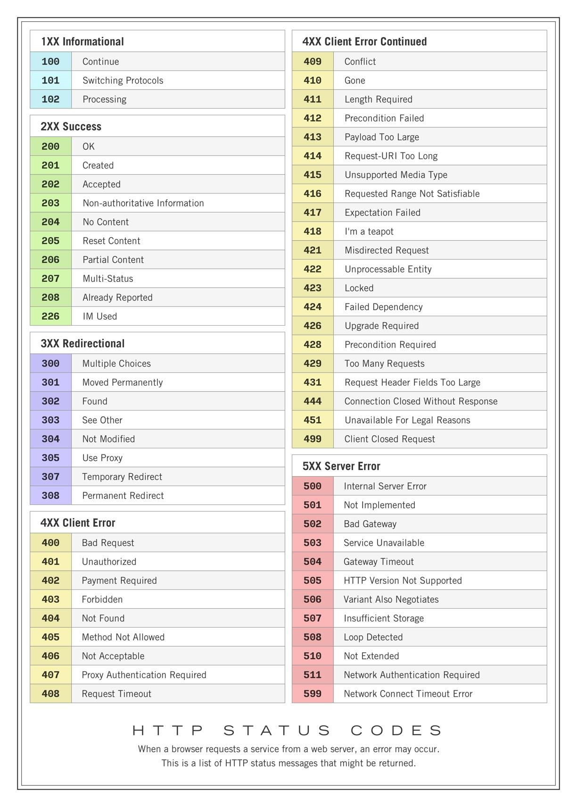

# Appendix A: HTTP Status Code Reference

The complete table, grouped by class. The handful in bold in Chapter 1 cover daily work; the rest reward recognition — a 409 Conflict or 429 Too Many Requests in a test run tells you exactly where to look.

